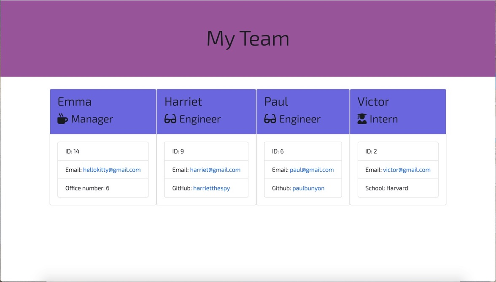

# Team Profile Generator

## Description

This CL application will be a vital tool to any company as a way to organize and store data about its employees.  It will serve management teams well to have a page they can visit in order to get easy access to basic information regarding their colleagues.  From the command line, the client is prompted to enter information about new employees that will then be stored as a reference - the employee name, contact, role in the company, etc. The clients input is rendered into an HTML page that can be accessed [here](https://sleepytomatoes.github.io/Team-Profile-Generator/).

## Installation

Using VSCode, from within the [repository](https://github.com/sleepytomatoes/Team-Profile-Generator), open an integrated terminal inside of index.js.  type npm install to install dependencies.  This application requires inquirer and jest.  Then run 'node index.js' and follow the prompts accordingly. 

## Usage

When you are finished adding employees, choose the option 'finish building team', at which point the html will be rendered into main.html.

## Credits

## Tests

To run tests for this application, from the inegrated terminal of index.js, type 'npm run test'.